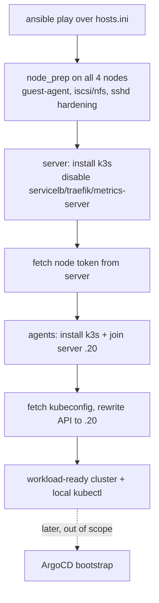

# k3s Install and Configure via Ansible

## Summary

Hand-rolled Ansible playbooks under `playbooks/` that prepare the four
provisioned Debian nodes and stand up a single-server k3s cluster — one server
(`192.168.1.20`) and three agents (`.21`/`.22`/`.23`) — tuned for the homelab's
GitOps stack. The phase ends at a workload-ready cluster plus a kubeconfig
fetched to the operator's machine; the ArgoCD bootstrap is a separate later
phase that consumes that kubeconfig.

---

## Problem Frame

The Terragrunt VM layer's contract ends at SSH-reachable Debian VMs plus
role-grouped IP outputs (`docs/plans/2026-06-12-001-feat-proxmox-debian-vms-terragrunt-plan.md`).
The VMs are bare: no container runtime, no cluster, and two items the VM layer
deliberately deferred — `qemu-guest-agent` and sshd password-auth hardening.
`playbooks/` is greenfield (an `ansible.cfg` with `inventory = hosts.ini`, an
empty `hosts.ini`, no roles or playbooks). This phase is the configuration layer
that turns those four hosts into the cluster everything above
(MetalLB, Longhorn, cert-manager, then GitOps workloads) sits on. Getting the
install declarative, idempotent, and correctly configured for the downstream
add-ons is what makes the GitOps phase a clean hand-off rather than a debugging
session.

---

## Key Decisions

- KD1. **Hand-rolled, config-file-driven — not the upstream collection.** Three
  roles (`node_prep`, `k3s_server`, `k3s_agent`) template a declarative
  `/etc/rancher/k3s/config.yaml` per node and run the official `get.k3s.io`
  installer. Rationale: zero external dependency to vendor or track, node config
  lives as readable repo YAML in the same declarative spirit as `argocd/`, and a
  4-node single-server fleet does not need the collection's HA/lifecycle
  machinery.
- KD2. **`node_prep` runs on all four nodes, including the server.** The k3s
  server is schedulable, and Longhorn runs on every schedulable node, so the
  iSCSI/NFS prerequisites must be present everywhere — not just on the agents.
- KD3. **Disable the bundled servicelb, traefik, and metrics-server.** Each is
  owned elsewhere: MetalLB owns load-balancing, the metrics-server ArgoCD app
  owns metrics, and ingress is a future GitOps add-on. servicelb and
  metrics-server are forced by what is already in `argocd/apps/`; disabling
  Traefik is a chosen consequence — the cluster has no ingress on day one.
- KD4. **Join token is fetched at runtime; no secret is committed.** The server
  generates its node token at install; Ansible reads it from the server and
  hands it to the agents. Nothing secret enters version control.
- KD5. **Single control-plane server, no HA.** Carried from the VM-layer
  decision — there is one server VM by design.
- KD6. **k3s version is pinned.** Re-runs are reproducible; an upgrade is a
  deliberate pin bump plus re-run, not automated drift.
- KD7. **kubeconfig is fetched with the API address rewritten to
  `192.168.1.20`.** The phase's hand-off artifact is a working `kubectl` context
  on the operator's machine, reachable off-host.

---

## Requirements

**Node preparation**

- R1. Before k3s install, every node installs and enables `qemu-guest-agent`.
- R2. Every node installs Longhorn's storage prerequisites: `open-iscsi` with
  `iscsid` enabled and running, and `nfs-common`.
- R3. Every node has sshd password authentication disabled (key-only access).

**k3s cluster install**

- R4. The server node installs k3s as a single control-plane server (no HA).
- R5. The three agents join the server using the server's runtime-generated node
  token and the server's inventory address; no token value is committed.
- R6. k3s installs at a pinned version via the official installer, driven by a
  declarative per-node `config.yaml`.

**Cluster configuration**

- R7. The server disables the bundled servicelb, Traefik, and metrics-server.

**Inventory and hand-off**

- R8. The playbooks consume `playbooks/hosts.ini` (`[server]` / `[agents]`
  groups, as produced by the Terragrunt `hosts_ini` output); agents derive the
  join address from the inventory's server entry.
- R9. On success, the cluster's kubeconfig is fetched to the operator's machine
  with the API server address rewritten to `192.168.1.20`, leaving a usable
  `kubectl` context.

**Idempotency**

- R10. Re-running the full play against a healthy cluster is a no-op — no
  reinstall, no re-join, no config drift.

---

## Key Flow

- F1. Bare nodes to workload-ready cluster
  - **Trigger:** Operator runs the play against `playbooks/hosts.ini`.
  - **Steps:** `node_prep` runs on all four nodes (guest-agent, iSCSI/NFS
    prereqs, sshd hardening); the server installs k3s with the disable flags via
    its `config.yaml`; Ansible fetches the server's node token; the three agents
    install and join using that token and the server address; Ansible fetches
    the kubeconfig and rewrites its server address to `192.168.1.20`.
  - **Outcome:** Four-node cluster (server + three agents) `Ready`, configured
    for the GitOps add-ons, with a working local `kubectl` context. The later
    ArgoCD phase (out of scope here) consumes this kubeconfig.

---

## Acceptance Examples

- AE1. Bare to cluster
  - **Given** the four VMs are SSH-reachable and k3s is not installed, **When**
    the play runs, **Then** the four nodes form one cluster — server and three
    agents all `Ready` — and the fetched kubeconfig drives `kubectl` from the
    operator's machine.
  - **Covers R1, R4, R5, R8, R9.**
- AE2. Idempotent re-run
  - **Given** a healthy cluster, **When** the play re-runs unchanged, **Then** it
    reports no changes and neither reinstalls nor re-joins any node.
  - **Covers R10.**
- AE3. Disabled components absent
  - **Given** the running cluster, **When** the operator inspects it, **Then**
    there are no klipper servicelb pods, no Traefik, and the k3s-bundled
    metrics-server is not deployed.
  - **Covers R7.**
- AE4. Storage prerequisites everywhere
  - **Given** the running cluster, **When** the operator checks any node
    including the server, **Then** `iscsid` is running and `nfs-common` is
    present.
  - **Covers R2.**

---

## Scope Boundaries

### Deferred for later

- ArgoCD install and the app-of-apps bootstrap — the next phase; it consumes the
  kubeconfig this phase produces.
- An ingress controller — Traefik is disabled and none is added here; ingress
  arrives as a GitOps add-on.
- HA control plane — single server is intentional.
- k3s upgrade automation — upgrades are a manual pin bump plus re-run.

### Follow-up dependency (not this phase)

- The Terraform `agent.enabled = true` flip plus re-apply. `node_prep` installs
  and enables `qemu-guest-agent`, but Proxmox will not use it until the VM layer
  is flipped and re-applied — installing the package here is only half the loop.

### Not handled here

- MetalLB, Longhorn, cert-manager, and metrics-server workload configuration —
  these live in `argocd/` and are applied in the GitOps phase, not by these
  playbooks.

---

## Dependencies and Assumptions

- The Terragrunt VM layer is applied; the four VMs answer SSH on `.20`–`.23` as
  user `debian` with the injected key.
- `playbooks/hosts.ini` is populated from `terragrunt output -raw hosts_ini`
  (`[server]` / `[agents]` groups).
- Nodes have internet egress to reach `get.k3s.io`, the pinned k3s release, and
  Debian package mirrors.
- LAN is `192.168.1.0/24`; the server's k3s API is reachable at
  `192.168.1.20:6443`.
- Downstream GitOps targets the add-ons already declared in `argocd/`: MetalLB
  0.15.2, Longhorn v1.8.1, metrics-server, cert-manager.

---

## Outstanding Questions

Deferred to planning (none block planning):

- Exact k3s version or channel to pin.
- kubeconfig destination details — merge into `~/.kube/config` versus a
  repo-local file, and the context name.
- Whether sshd hardening is its own task or folded into `node_prep`; the Debian
  cloud image is already key-only, so R3 is belt-and-suspenders.

---

## Sources / Research

- Origin VM layer: `docs/plans/2026-06-12-001-feat-proxmox-debian-vms-terragrunt-plan.md`
  and `terraform/README.md` — fleet shape, `debian` user, `hosts_ini` output,
  the `qemu-guest-agent` and sshd-hardening deferrals (KTD3).
- k3s server flags: `--disable servicelb`, `--disable traefik`,
  `--disable metrics-server`; declarative `/etc/rancher/k3s/config.yaml`;
  runtime node token at `/var/lib/rancher/k3s/server/node-token`; official
  installer at `get.k3s.io`.
- Downstream constraints from `argocd/apps/`: MetalLB requires k3s servicelb
  disabled; Longhorn requires `open-iscsi`/`nfs-common` on every schedulable
  node; metrics-server ships as its own app, so the k3s-bundled one is disabled.
