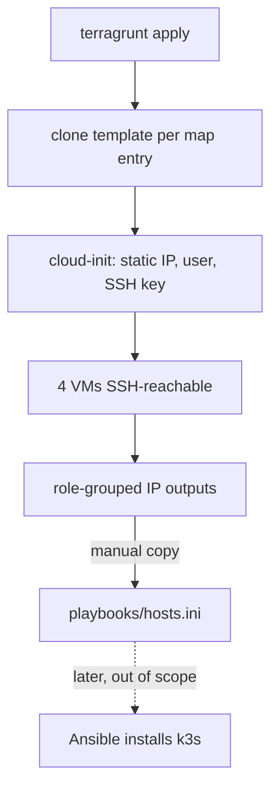

# Proxmox Debian VMs via Terragrunt

## Summary

Provision four Debian VMs on the Proxmox host at `192.168.1.10:8006` using Terragrunt under `terraform/`: one k3s server and three agents, with static cloud-init IPs and AWS S3 remote state, all from a single unit driven by a VM map. The layer's contract ends at healthy, SSH-reachable VMs plus role-grouped IP outputs; k3s is installed later via Ansible.

---

## Problem Frame

The previous homelab is being rebuilt from scratch — its old Terraform, Ansible, and ArgoCD artifacts are dead and carry no constraints. This brainstorm defines the foundation layer: the VM fleet that everything above (k3s, then GitOps workloads) will sit on. Getting the provisioning layer declarative, reproducible, and cleanly seamed to the future k3s step is what makes the rest of the rebuild tractable.

---

## Key Decisions

- Provider `bpg/proxmox`. Modern and actively maintained; chosen over the older `Telmate/proxmox`.
- Base image Debian 13 (trixie) cloud image + cloud-init. Template-clone is the declarative provisioning path; trixie is current stable.
- k3s via Ansible, deferred. Despite the "all IaC in Terragrunt" framing, cluster install lives in `playbooks/`. This splits provisioning from configuration; Terragrunt's responsibility ends at reachable VMs plus outputs.
- Single unit, `for_each` over a VM map. All VMs share one Terragrunt unit and one state file. Simplest for a small homogeneous fleet; trade-off: recreating one VM requires `-target` because state is shared.
- AWS S3 remote state. Off-host and durable, and AWS is independent of the homelab so there is no bootstrap chicken-and-egg with Proxmox.
- Static IPs in cloud-init. Gives the k3s server a stable join target and needs no router-side reservation.
- Secrets via environment variables. No secret values in version control; `.env.example` documents the variables, `.env` is gitignored.

---

## Requirements

**VM provisioning**

- R1. Terragrunt provisions four Debian VMs on the Proxmox host at `192.168.1.10`: one k3s server and three agents.
- R2. VMs are cloned from a Debian cloud-image template and configured through cloud-init (hostname, user, SSH key, network).
- R3. One reusable VM module is instantiated per VM via `for_each` over a VM-definitions map (name, role, IP, sizing); adding or removing a node is a single map-entry edit.

**Networking and access**

- R4. Each VM receives a static IPv4 via cloud-init on `192.168.1.0/24` (gateway `.1`): server `.20`, agents `.21`/`.22`/`.23`.
- R5. Each VM is reachable over SSH with the injected public key; password authentication is disabled.

**State and structure**

- R6. Terragrunt keeps state in AWS S3 via a DRY root config that generates the `remote_state` and Proxmox `provider` blocks for the unit.
- R7. Re-applying with an unchanged map is a no-op; changing one VM's map entry converges only that VM.

**Secrets**

- R8. The Proxmox API token and AWS credentials are supplied via environment variables; a committed `.env.example` documents them and `.env` is gitignored. No secret values are committed.

**k3s seam and outputs**

- R9. The unit outputs each VM's name and IP grouped by role (server vs agents), in a form that pastes cleanly into `playbooks/hosts.ini`.
- R10. Terragrunt does not install k3s; the role-grouped outputs are the only contract the later Ansible k3s phase consumes.

---

## Key Flow

- F1. Provision and hand off
  - **Trigger:** Operator runs `terragrunt apply` in the VM unit.
  - **Steps:** Root config generates backend + provider; the module clones the template per map entry; cloud-init applies static IP, user, and SSH key; VMs boot and become SSH-reachable; the unit emits role-grouped IP outputs.
  - **Outcome:** Operator copies the outputs into `playbooks/hosts.ini`; a later Ansible run (out of scope here) installs k3s.

---

## Acceptance Examples

- AE1. Clean apply
  - **Given** no VMs exist, **When** `apply` runs, **Then** four VMs exist and answer SSH on `.20`–`.23`.
  - **Covers R1, R4, R5.**
- AE2. Idempotent re-apply
  - **Given** the VMs are provisioned and the map is unchanged, **When** `apply` runs again, **Then** the plan reports no changes.
  - **Covers R7.**
- AE3. Single-node change
  - **Given** one agent's sizing is changed in the map, **When** `apply` runs, **Then** only that VM is modified.
  - **Covers R3, R7.**
- AE4. Outputs seam
  - **Given** a successful apply, **When** the operator reads the outputs, **Then** server and agent IPs are grouped by role and paste cleanly into `playbooks/hosts.ini`.
  - **Covers R9.**

---

## Scope Boundaries

- Deferred for later: k3s install (Ansible, separate phase), cluster workloads and ArgoCD/GitOps, and HA control plane (single server is intentional).
- Manual seam: the Ansible inventory is not auto-generated; `playbooks/hosts.ini` is populated by hand from the outputs.
- Not migrated: the old `terraform/longhorn`, `playbooks/`, and `argocd/` contents are treated as dead and are neither reused nor migrated.

---

## Dependencies and Assumptions

- Proxmox VE is reachable at `192.168.1.10:8006` with an API token authorized to clone and create VMs.
- A Proxmox node name, storage pool, and network bridge exist on the host (identified at planning).
- An AWS account with an S3 bucket and credentials is available for Terragrunt state.
- A Debian 13 cloud image is obtainable (pre-downloaded to Proxmox or fetched during provisioning).
- The LAN is `192.168.1.0/24`, gateway `.1`, with `.20`–`.23` free and the Proxmox host at `.10`.
- An SSH public key is available to inject via cloud-init.

---

## Outstanding Questions

Deferred to planning (none block planning):

- Exact Proxmox node name, storage pool, and network bridge.
- Whether the cloud-image template is created by Terraform or assumed pre-existing.
- Final per-VM sizing (default carried: 2 vCPU / 4 GB / 40 GB).
- Debian image version pinning strategy.

---

## Sources / Research

- `bpg/proxmox` Terraform provider for Proxmox VE — chosen over `Telmate/proxmox`.
- Debian official cloud images (genericcloud) as the cloud-init template source.
