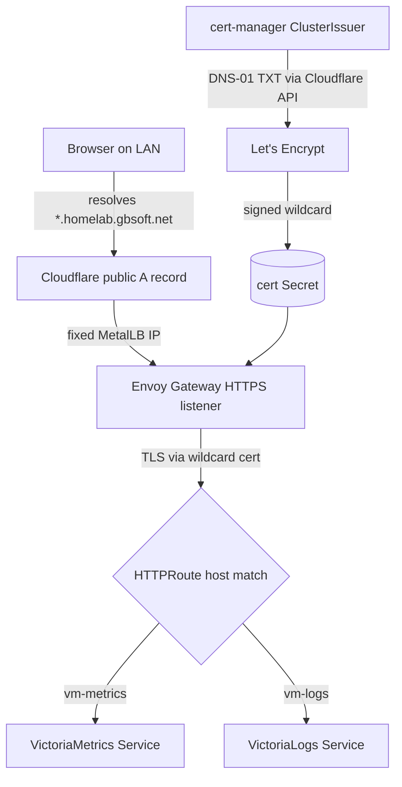

# Browser-Trusted TLS Access to Internal Apps via Envoy Gateway

## Summary

Stand up Gateway API ingress on the k3s cluster by deploying Envoy Gateway
(`gateway-helm` 1.8.1) as an ArgoCD `Application`, and front VictoriaMetrics and
VictoriaLogs at `vm-metrics.homelab.gbsoft.net` / `vm-logs.homelab.gbsoft.net`
behind a Let's Encrypt wildcard certificate (`*.homelab.gbsoft.net`) that
cert-manager issues over the ACME DNS-01 challenge via Cloudflare. cert-manager
and MetalLB already run on the cluster and are reused unchanged.

---

## Problem Frame

The cluster has no ingress. Traefik was deliberately disabled at k3s install
(`docs/brainstorms/2026-06-12-k3s-ansible-install-requirements.md`, KD3), so the
only ways to reach an in-cluster web UI today are `kubectl port-forward` or a raw
`NodePort`/Service IP — neither of which carries a browser-trusted certificate,
so every visit means a TLS warning or a tunnel. The pieces to fix this are
already half in place: cert-manager (v1.17.2) is installed and already runs
`--enable-gateway-api`, and MetalLB (v0.15.2) owns LAN load-balancer IPs from the
`192.168.1.80-.85` pool. What is missing is the gateway itself plus the glue —
an ACME issuer, a wildcard certificate, and host-based routes — that turns those
two add-ons into named, HTTPS-trusted hostnames.

---

## Key Decisions

- **Gateway API via Envoy Gateway, not a classic Ingress controller.**
  cert-manager already runs with `--enable-gateway-api` and k3s ships no ingress
  (Traefik disabled), so Gateway API is the path of least resistance and the
  direction the cluster was already pointed.
- **A single wildcard certificate over per-host certs.** The ACME DNS-01
  challenge can mint wildcards (HTTP-01 cannot), so one `*.homelab.gbsoft.net`
  cert covers every app and adding a future app is just a new HTTPRoute — no new
  certificate and no new DNS record.
- **Let's Encrypt over DNS-01, with a public Cloudflare record pointing at the
  private gateway IP.** DNS-01 keeps the apps fully internal (nothing exposed to
  the internet for validation), and reusing the Cloudflare-hosted zone for the
  public A record needs zero extra LAN infrastructure. The DNS-rebinding caveat
  (some resolvers refuse public names that answer with RFC1918 addresses) is
  accepted.
- **The Cloudflare API token is provisioned out-of-band.** It lands as a
  Kubernetes Secret created outside git, mirroring the existing
  `longhorn-backup-secret` pattern; no token value is committed to the repo.
- **The gateway claims one fixed IP from the MetalLB pool.** Because the wildcard
  A record is a single address, the gateway's LoadBalancer Service must bind a
  stable IP rather than take whatever MetalLB assigns.
- **Reuse cert-manager and MetalLB as-is.** Both already exist with the right
  configuration; this round adds only Envoy Gateway and the routing/issuance
  glue.

---

## Requirements

**Ingress gateway**

- R1. Envoy Gateway is deployed as an ArgoCD `Application` from the OCI chart
  `oci://docker.io/envoyproxy/gateway-helm`, pinned to `1.8.1`, following the
  one-app-per-file convention in `argocd/apps/`.
- R2. A `GatewayClass` and `Gateway` expose an HTTPS listener serving
  `*.homelab.gbsoft.net`, with plain HTTP redirected to HTTPS.
- R3. The gateway's LoadBalancer Service binds a fixed IP from the MetalLB pool
  (`192.168.1.80-.85`) so the wildcard DNS record targets a stable address.

**Certificate issuance**

- R4. A cert-manager ACME `ClusterIssuer` uses Let's Encrypt with the DNS-01
  solver backed by Cloudflare.
- R5. cert-manager issues one wildcard certificate for `*.homelab.gbsoft.net`,
  which the gateway's HTTPS listener consumes.
- R6. The Cloudflare API token is supplied via a Secret provisioned out-of-band;
  no token value is committed to the repo.

**App exposure and routing**

- R7. An HTTPRoute exposes the VictoriaMetrics UI at `vm-metrics.homelab.gbsoft.net`.
- R8. An HTTPRoute exposes the VictoriaLogs UI at `vm-logs.homelab.gbsoft.net`.
- R9. Routes attach to the shared gateway across namespaces — the VM apps live in
  `victoria-metrics` / `victoria-logs`, while the gateway lives in its own
  namespace.

**DNS**

- R10. A public Cloudflare wildcard A record (`*.homelab.gbsoft.net`) resolves to
  the gateway's fixed LAN IP.

---

## Key Flows

- F1. Browser reaches an internal app over trusted TLS
  - **Trigger:** User opens `https://vm-metrics.homelab.gbsoft.net` on the LAN.
  - **Steps:** Cloudflare resolves the wildcard name to the gateway's LAN IP;
    Envoy Gateway terminates TLS using the wildcard cert; the HTTPS listener's
    HTTPRoute matches the host and forwards to the VictoriaMetrics Service.
  - **Outcome:** The VictoriaMetrics UI loads with a valid, non-warning
    certificate.
- F2. cert-manager issues the wildcard certificate
  - **Trigger:** The `Certificate` (or gateway annotation) requests
    `*.homelab.gbsoft.net`.
  - **Steps:** cert-manager opens an ACME order against Let's Encrypt; the DNS-01
    solver writes the `_acme-challenge` TXT record via the Cloudflare API using
    the out-of-band token Secret; Let's Encrypt validates and signs; the cert is
    stored in a Secret the gateway listener reads.
  - **Outcome:** A renewable wildcard cert backs every `*.homelab.gbsoft.net`
    hostname.

---

## Acceptance Examples

- AE1. Trusted TLS in the browser
  - **Covers R2, R5, R7.**
  - **Given** the gateway, cert, and HTTPRoute are synced,
  - **When** the operator opens `https://vm-metrics.homelab.gbsoft.net`,
  - **Then** the VictoriaMetrics UI loads with a publicly-trusted certificate and
    no browser warning.
- AE2. Wildcard certificate issued
  - **Covers R4, R5, R6.**
  - **Given** the ClusterIssuer and Cloudflare token Secret exist,
  - **When** cert-manager processes the request,
  - **Then** the `Certificate` reports `Ready=True` and its Secret holds a
    Let's Encrypt-signed `*.homelab.gbsoft.net` cert.
- AE3. HTTP redirects to HTTPS
  - **Covers R2.**
  - **Given** the gateway is serving,
  - **When** a client requests `http://vm-logs.homelab.gbsoft.net`,
  - **Then** it is redirected to the `https://` URL.
- AE4. Second app reuses the same wildcard
  - **Covers R8.**
  - **Given** the wildcard cert is already issued,
  - **When** the VictoriaLogs HTTPRoute is added,
  - **Then** `vm-logs.homelab.gbsoft.net` serves over the existing cert with no
    new certificate issued.

---

## Scope Boundaries

### Deferred for later

- Exposing the ArgoCD and Longhorn UIs — only the two VictoriaMetrics/Logs UIs in
  this round.
- Any authentication or authorization in front of the exposed UIs — they are
  reachable by anyone who can hit the gateway on the LAN.
- A local DNS resolver for `*.homelab.gbsoft.net` — the public Cloudflare record
  was chosen instead.

### Outside this round's shape

- An internal CA or the HTTP-01 challenge — the trust model is public Let's
  Encrypt via DNS-01.
- Redeploying or reconfiguring cert-manager and MetalLB — both already exist and
  are reused.
- Non-HTTP (TCP/UDP) routing through the gateway.

---

## Dependencies / Assumptions

- cert-manager v1.17.2 is running with `--enable-gateway-api`
  (`argocd/apps/cert-manager.yaml`).
- MetalLB v0.15.2 is running with the `192.168.1.80-.85` pool in L2 mode
  (`argocd/apps/metallb.yaml`, `argocd/manifests/metallb/metallb-config.yaml`).
- Cloudflare hosts the `gbsoft.net` zone, and an API token with DNS-edit
  permission on it is available to create the out-of-band Secret.
- VictoriaMetrics and VictoriaLogs are deployed
  (`argocd/apps/victoria-metrics.yaml`, `argocd/apps/victoria-logs.yaml`), each
  serving its UI on a reachable in-cluster Service.
- LAN clients can route to `192.168.1.8x` and their resolver does not block the
  public hostname answering with an RFC1918 address (no DNS-rebinding
  protection in the path).
- ArgoCD watches `argocd/apps/` and syncs to `https://kubernetes.default.svc`.

---

## Outstanding Questions (Deferred to Planning)

- Namespace for the `GatewayClass`/`Gateway`, and how cross-namespace routing is
  permitted (the listener's `allowedRoutes` plus any `ReferenceGrant` needed for
  the cert Secret).
- Where the glue manifests (`Gateway`, `ClusterIssuer`, `Certificate`,
  HTTPRoutes) live: a second source on the envoy-gateway app, on the existing
  cert-manager app, co-located with each VM app, or a new app.
- Whether the Cloudflare A record is created manually or automated (external-dns
  is not deployed).
- Let's Encrypt environment (staging first vs. production directly) and the ACME
  account email.
- The exact backend Service name and port for the VictoriaMetrics (vmui) and
  VictoriaLogs UIs.
- How the fixed gateway IP is pinned (Service `loadBalancerIP` vs. a MetalLB
  annotation).

---

## Sources / Research

- `helm show chart oci://docker.io/envoyproxy/gateway-helm` → latest stable
  `gateway-helm` 1.8.1 (appVersion v1.8.1); a `1.9.0-rc.0` exists but is a
  release candidate and is not used. Envoy Gateway ships as an OCI chart, so
  `helm search repo` does not index it.
- `argocd/apps/cert-manager.yaml` — cert-manager 1.17.2 already runs
  `--enable-gateway-api`, so the cluster is primed for Gateway API.
- `argocd/apps/metallb.yaml`, `argocd/manifests/metallb/metallb-config.yaml` —
  MetalLB 0.15.2, L2 pool `192.168.1.80-.85`; the gateway IP comes from here.
- `argocd/apps/victoria-metrics.yaml`, `argocd/apps/victoria-logs.yaml` — the two
  backends being exposed.
- `docs/brainstorms/2026-06-12-k3s-ansible-install-requirements.md` — Traefik
  disabled at k3s (no ingress on day one); LAN is `192.168.1.0/24`.
- `argocd/apps/longhorn.yaml` — `longhorn-backup-secret` is the precedent for an
  out-of-band Secret consumed by an app but not committed.
