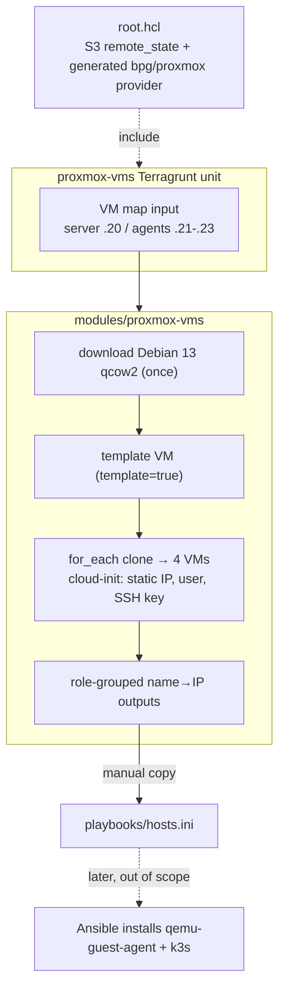

# feat: Provision Debian VMs on Proxmox via Terragrunt

## Summary

Build a Terragrunt-managed provisioning layer under `terraform/` that stands up four Debian 13 VMs on the Proxmox host at `192.168.1.10:8006` — one k3s server and three agents — from a cloned cloud-init template, with static IPs and AWS S3 remote state. The layer's contract ends at SSH-reachable VMs plus role-grouped IP outputs; k3s is installed later via Ansible.

---

## Problem Frame

The homelab is being rebuilt from scratch; the existing `terraform/longhorn`, `playbooks/`, and `argocd/` contents are dead and carry no constraints. This plan delivers the foundation layer the rest of the rebuild sits on. Getting it declarative, reproducible, and cleanly seamed to the deferred k3s step is what makes the later work tractable. The provider (`bpg/proxmox`) and Terragrunt are both net-new to this repo.

---

## Requirements

Carried from the origin requirements doc (see origin: `docs/brainstorms/2026-06-12-proxmox-debian-vms-terragrunt-requirements.md`).

**VM provisioning**

- R1. Terragrunt provisions four Debian VMs on the Proxmox host at `192.168.1.10`: one k3s server, three agents.
- R2. VMs are cloned from a Debian 13 cloud-image template and configured through cloud-init (hostname, user, SSH key, network).
- R3. One reusable VM module is instantiated per VM via `for_each` over a VM-definitions map (name, role, vm_id, IP, sizing); adding or removing a node is a single map-entry edit.

**Networking and access**

- R4. Each VM receives a static IPv4 via cloud-init on `192.168.1.0/24` (gateway `.1`): server `.20`, agents `.21`/`.22`/`.23`.
- R5. Each VM is reachable over SSH using the injected public key; the Debian cloud image's default user ships with no password, so there is no password-login path.

**State and structure**

- R6. Terragrunt keeps state in AWS S3 via a DRY root config that generates the `remote_state` and `bpg/proxmox` provider blocks for the unit.
- R7. Re-applying with an unchanged map is a no-op; changing one VM's map entry converges only that VM.

**Secrets**

- R8. The Proxmox API token and AWS credentials are supplied via environment variables; a committed `.env.example` documents them and `.env` is gitignored. No secret values are committed.

**k3s seam and outputs**

- R9. The unit outputs each VM's name and IP grouped by role (server vs agents), in a form that pastes cleanly into `playbooks/hosts.ini`.
- R10. Terragrunt does not install k3s; the role-grouped outputs are the only contract the later Ansible k3s phase consumes.

---

## Key Technical Decisions

- KTD1. **Provider `bpg/proxmox`, pinned `~> 0.109.0`.** Auth via environment variables (`PROXMOX_VE_ENDPOINT`, `PROXMOX_VE_API_TOKEN`, `PROXMOX_VE_INSECURE=true` for the self-signed PVE cert). The endpoint must end with `/` and must not include `/api2/json`. Token format is `user@realm!tokenid=secret`.

- KTD2. **Image → template → clone.** Download the Debian 13 (trixie) genericcloud qcow2 once into a Proxmox storage as an importable disk, build one template VM that imports it, then clone all four VMs from that template via `for_each`. Matches the origin's "cloned from a template" and keeps per-VM differences (vm_id, IP) in the map.

- KTD3. **QEMU guest agent off at provision; outputs sourced from the static IP map.** Debian genericcloud ships without `qemu-guest-agent`; enabling `agent` without the guest package stalls create/refresh and hangs destroy. Because cloud-init assigns the exact static IPs from the map, the outputs are derived from the map inputs (authoritative) rather than agent readback. Set `stop_on_destroy = true` so destroys don't hang. The later Ansible playbook installs `qemu-guest-agent`.

- KTD4. **Single Terragrunt unit, `for_each` over a VM map, one state file.** Trade-off: recreating a single VM requires `-target` because state is shared — acceptable for a four-node homelab fleet.

- KTD5. **S3 remote state with native lockfile (`use_lockfile = true`), no DynamoDB.** State key namespaced per unit via `path_relative_to_include()`. Requires Terraform ≥ 1.11 or OpenTofu ≥ 1.10.

- KTD6. **Terragrunt root named `root.hcl` (not bare `terragrunt.hcl`), labeled `include "root"`.** Current Terragrunt strict mode discourages a `terragrunt.hcl` root; child units keep `terragrunt.hcl` and pull the parent via `find_in_parent_folders("root.hcl")`.

---

## High-Level Technical Design

The module owns three resource stages; the Terragrunt unit feeds it the VM map and the root config injects backend + provider. The seam to k3s is the role-grouped outputs, copied by hand into the Ansible inventory.



---

## Output Structure

```text
terraform/
  root.hcl                       # S3 remote_state + generated bpg/proxmox provider
  proxmox-vms/
    terragrunt.hcl               # include root; source module; 4-VM map inputs
  modules/
    proxmox-vms/
      versions.tf                # required_version pin
      variables.tf               # vms map, node_name, datastores, bridge, gateway, ssh key, image url, sizing defaults
      images.tf                  # image download + template VM
      vms.tf                     # for_each VM clone + cloud-init
      outputs.tf                 # role-grouped name→IP
  .env.example                   # PROXMOX_VE_* + AWS_* placeholders
```

The tree is a scope declaration, not a constraint — the implementer may merge or split `.tf` files if a cleaner layout emerges. Per-unit `**Files:**` remain authoritative.

---

## Implementation Units

### U1. Terragrunt root config and S3 backend

- **Goal:** DRY root that generates the S3 backend and the `bpg/proxmox` provider for every unit below it.
- **Requirements:** R6, R8 (provider token sourced from env, not hardcoded).
- **Dependencies:** none.
- **Files:** `terraform/root.hcl`
- **Approach:** `remote_state` block with `backend = "s3"`, `generate` into `backend.tf`, config `bucket`/`key = "${path_relative_to_include()}/tofu.tfstate"`/`region`/`encrypt = true`/`use_lockfile = true`. A `generate "provider"` block emits `provider.tf` carrying `required_providers` (`proxmox = { source = "bpg/proxmox", version = "~> 0.109.0" }`) and the `provider "proxmox"` block with `endpoint` and `insecure = true`; the API token comes from `PROXMOX_VE_API_TOKEN` (not written into the file).
- **Patterns to follow:** none in-repo (greenfield); follow the bpg/proxmox + Terragrunt v1.0 patterns in Sources.
- **Test scenarios:**
  - `terragrunt validate` in a child unit succeeds with the generated `backend.tf` and `provider.tf` present.
  - Generated provider config contains no literal token value (token resolves from env).
- **Verification:** A child unit initializes against S3 with native lockfile and no DynamoDB table.

### U2. Module: image download and template VM

- **Goal:** Make a reusable `proxmox-vms` module that downloads the Debian 13 image once and builds a clone source template.
- **Requirements:** R1, R2.
- **Dependencies:** U1.
- **Files:** `terraform/modules/proxmox-vms/versions.tf`, `terraform/modules/proxmox-vms/variables.tf`, `terraform/modules/proxmox-vms/images.tf`
- **Approach:** `variables.tf` declares `node_name`, `image_datastore` (import content), `disk_datastore` (e.g. `local-lvm`), `network_bridge`, `gateway`, `dns_servers`, `vm_user`, `ssh_public_key`, `debian_image_url`, `vms` map, and sizing defaults. `images.tf` downloads the genericcloud qcow2 with the image-download resource (`content_type = "import"`), then a template VM (`template = true`, `started = false`) whose `disk.import_from` references the download. `versions.tf` pins `required_version`. Provider config is injected by U1's generate block — the module declares no provider block.
- **Patterns to follow:** bpg `proxmox_virtual_environment_vm` + image-download patterns in Sources.
- **Test scenarios:**
  - `terragrunt plan` shows exactly one download resource and one template VM, with `template = true`.
  - Plan fails clearly if `image_datastore` lacks the `import` content type (caught at apply; surfaced as a Risk).
  - `Covers R2.` Plan references the Debian 13 trixie genericcloud URL, not an older release.
- **Verification:** Applying just the template stage produces a VM marked as a template in Proxmox, importing the downloaded disk.

### U3. Module: per-VM clone with static cloud-init networking

- **Goal:** Clone the template into the four VMs via `for_each`, injecting per-VM identity, static IP, user, and SSH key.
- **Requirements:** R1, R3, R4, R5, R7.
- **Dependencies:** U2.
- **Files:** `terraform/modules/proxmox-vms/vms.tf`
- **Approach:** A single `proxmox_virtual_environment_vm` resource with `for_each = var.vms`, `clone.vm_id` pointing at the template, `name = each.key`, `vm_id`/`cpu`/`memory`/`disk.size` from `each.value` (falling back to sizing defaults), `network_device.bridge = var.network_bridge`, and `initialization.ip_config.ipv4` with `address = each.value.ip` (CIDR) and `gateway = var.gateway`. `initialization.user_account` carries `var.vm_user` plus the injected SSH key, `initialization.dns` is set from `var.dns_servers`, and `initialization.upgrade = false` (the default `true` is a `root@pam`-only operation that 403s under token auth — KTD1). `agent { enabled = false }` and `stop_on_destroy = true` per KTD3.
- **Patterns to follow:** the bpg `for_each` clone snippet in Sources.
- **Test scenarios:**
  - `Covers AE1.` `terragrunt plan` from empty state shows four VMs cloned from the template with distinct `vm_id` and the four static IPs `.20`–`.23`.
  - `Covers AE2.` Re-`plan` after apply with an unchanged map reports no changes (R7 idempotency).
  - `Covers AE3.` Changing one agent's sizing in the map yields a plan that modifies only that VM (R3, R7).
  - Each VM's `initialization.ip_config.ipv4` carries a `/24` CIDR and the `.1` gateway; password auth is not the access path (R5).
  - `agent.enabled` is false, `stop_on_destroy` is true, and `initialization.upgrade` is false (no destroy hang, no token-auth 403).
- **Verification:** After apply, all four VMs answer SSH on `.20`–`.23` with the injected key.

### U4. Module: role-grouped outputs

- **Goal:** Emit name→IP outputs grouped by role for the manual `hosts.ini` step.
- **Requirements:** R9, R10.
- **Dependencies:** U3.
- **Files:** `terraform/modules/proxmox-vms/outputs.tf`
- **Approach:** Derive outputs from the `vms` map (authoritative IPs per KTD3), not from agent readback. Produce a `server` output (name + IP) and an `agents` output (map or list of name + IP), plus a combined view shaped for easy copy into `playbooks/hosts.ini` groups (`[server]` / `[agents]`).
- **Patterns to follow:** map/`for` expression over `var.vms` filtered by `role`.
- **Test scenarios:**
  - `Covers AE4.` `terragrunt output` after apply lists the server under its role and the three agents under theirs, with correct IPs.
  - Outputs reflect the map even with the guest agent disabled (no empty `ipv4_addresses` dependency).
- **Verification:** Output text drops into `playbooks/hosts.ini` server/agents groups without hand-editing IPs.

### U5. Terragrunt unit wiring and VM map

- **Goal:** The single unit that includes the root, sources the module, and defines the four-VM map.
- **Requirements:** R1, R3, R6.
- **Dependencies:** U1, U2, U3, U4.
- **Files:** `terraform/proxmox-vms/terragrunt.hcl`
- **Approach:** `include "root" { path = find_in_parent_folders("root.hcl") }`, `terraform { source = "../modules/proxmox-vms" }`, and `inputs` carrying `node_name`, datastores, bridge, gateway, DNS servers, VM user, ssh key, image URL, and the `vms` map (`k3s-server` = `{vm_id, role="server", ip="192.168.1.20/24"}`, `k3s-agent-1..3` = `.21`/`.22`/`.23`, role `agent`).
- **Patterns to follow:** the child-unit snippet in Sources.
- **Test scenarios:**
  - `terragrunt validate` succeeds; `plan` shows the full four-VM set plus template and download.
  - Map carries server `.20` and agents `.21`/`.22`/`.23` with role tags driving the grouped outputs.
- **Verification:** `terragrunt apply` in `terraform/proxmox-vms/` provisions the layer end-to-end and writes state to S3.

### U6. Secrets and environment scaffolding

- **Goal:** Document required secrets without committing any, satisfying the security guardrail.
- **Requirements:** R8.
- **Dependencies:** none.
- **Files:** `.env.example`; confirm `.gitignore` coverage.
- **Approach:** `.env.example` lists `PROXMOX_VE_ENDPOINT`, `PROXMOX_VE_API_TOKEN`, `PROXMOX_VE_INSECURE`, and `AWS_PROFILE`/`AWS_ACCESS_KEY_ID`/`AWS_SECRET_ACCESS_KEY` with placeholder values and a one-line comment each. `.gitignore` already ignores `.env`, `*.tfvars`, `*.tfstate`, `**/.terraform/*` — verify, no change expected. `.env.example` itself is committed (not ignored).
- **Test scenarios:** `Test expectation: none -- scaffolding/docs.` Verify `.env` is gitignored and `.env.example` is tracked; confirm no secret literal appears in any committed file.
- **Verification:** `git check-ignore .env` matches; `.env.example` is staged with placeholders only.

---

## Acceptance Examples

Carried from origin; drive the apply-time verification in U3/U4.

- AE1. Clean apply — Given no VMs exist, When `apply` runs, Then four VMs exist and answer SSH on `.20`–`.23`. (R1, R4, R5)
- AE2. Idempotent re-apply — Given the VMs are provisioned and the map is unchanged, When `apply` runs again, Then the plan reports no changes. (R7)
- AE3. Single-node change — Given one agent's sizing is changed in the map, When `apply` runs, Then only that VM is modified. (R3, R7)
- AE4. Outputs seam — Given a successful apply, When the operator reads the outputs, Then server and agent IPs are grouped by role and paste cleanly into `playbooks/hosts.ini`. (R9)

---

## Scope Boundaries

- Deferred for later: k3s install (Ansible, separate phase), `qemu-guest-agent` install (Ansible), sshd-level password-auth hardening (`PasswordAuthentication no`, Ansible — provision-time would need the SSH-snippet path KTD3 avoids), cluster workloads and ArgoCD/GitOps, HA control plane (single server is intentional).
- Manual seam: the Ansible inventory is not auto-generated; `playbooks/hosts.ini` is populated by hand from the outputs.

### Deferred to Follow-Up Work

- Migrating off the image-download resource to its v1.0 replacement once the rename lands (see Risks).

### Not migrated

- The old `terraform/longhorn`, `playbooks/`, and `argocd/` contents — treated as dead, neither reused nor migrated.

---

## Risks & Dependencies

**Risks**

- API token privileges: image import needs `Sys.Audit`/`Sys.Modify`/`Datastore.AllocateTemplate` plus VM allocation rights. The `root@pam`-only `initialization.upgrade` is set to `false` in U3 to avoid a first-apply 403 under token auth. Mitigation: grant the token adequate import/VM privileges.
- The `import` content type must be enabled on the target Proxmox storage (Datacenter → Storage) before apply.
- The image-download resource is deprecated in 0.109.0 (slated for removal in provider v1.0). Mitigation: pin `~> 0.109.0` now; track the replacement and migrate before bumping past v1.0.
- VM IDs (e.g. 9000–9004) must be free on the host, or apply collides with existing guests.

**Dependencies / Assumptions**

- Proxmox VE reachable at `192.168.1.10:8006` with an API token authorized to clone/create VMs and import disks.
- A Proxmox node name, disk datastore, image (import) datastore, and network bridge exist on the host — supplied as module inputs at apply.
- An AWS S3 bucket for state already exists (one-time out-of-band bootstrap) and AWS credentials are available.
- Terraform ≥ 1.11 or OpenTofu ≥ 1.10 (for native S3 `use_lockfile`).
- LAN is `192.168.1.0/24`, gateway `.1`, addresses `.20`–`.23` free, Proxmox host at `.10`.
- An SSH public key is available to inject via cloud-init.

---

## Open Questions

Deferred to implementation (none block the plan):

- Exact Proxmox node name, disk datastore, image datastore, and bridge — set as module inputs once confirmed against the host.
- Exact current name of the non-deprecated image-download resource and whether to adopt it now vs. pin-and-migrate (decision: pin-and-migrate, per Risks).
- Final per-VM sizing (default 2 vCPU / 4 GB / 40 GB).

---

## Sources / Research

- `bpg/proxmox` provider 0.109.0 (2026-06-06): `proxmox_virtual_environment_vm` (`clone`, `cpu`, `memory`, `disk`, `network_device`, `initialization.ip_config`/`user_account`, `agent`, `stop_on_destroy`); image-download resource with `content_type = "import"` + `disk.import_from`; auth via `PROXMOX_VE_ENDPOINT`/`PROXMOX_VE_API_TOKEN`/`PROXMOX_VE_INSECURE`. Registry: `registry.terraform.io/providers/bpg/proxmox`; source: `github.com/bpg/terraform-provider-proxmox` (`docs/index.md`, `docs/resources/virtual_environment_vm.md`, `docs/resources/virtual_environment_download_file.md`).
- Caveat — `ipv4_addresses` output is populated only with `agent.enabled = true` and a running `qemu-guest-agent`; Debian genericcloud lacks it, so outputs derive from the static map (KTD3).
- Terragrunt v1.0 (`docs.terragrunt.com`): `root.hcl` parent with `remote_state` (S3, `use_lockfile`, key via `path_relative_to_include()`) + `generate "provider"`; child unit via labeled `include "root"` + `terraform { source = ... }` + `inputs`.
