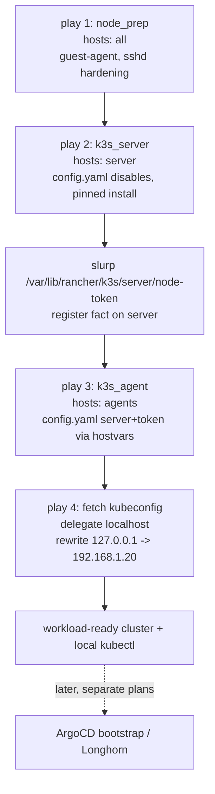

# feat: Install and configure k3s via Ansible

## Summary

Build hand-rolled Ansible under `playbooks/` that preps the four provisioned
Debian nodes and stands up a single-server k3s cluster — one server
(`192.168.1.20`) and three agents (`.21`/`.22`/`.23`) — pinned to k3s
`v1.36.1+k3s1` and configured for the homelab's GitOps stack. Three roles
(`node_prep`, `k3s_server`, `k3s_agent`) driven by a `site.yml` entrypoint
template declarative per-node `config.yaml` files and run the official
installer. The phase ends at a workload-ready cluster plus a kubeconfig fetched
to the operator's machine; ArgoCD bootstrap and Longhorn are separate later
phases.

---

## Problem Frame

The Terragrunt VM layer (see origin: `docs/plans/2026-06-12-001-feat-proxmox-debian-vms-terragrunt-plan.md`)
ends at four SSH-reachable Debian VMs plus role-grouped IP outputs. `playbooks/`
is greenfield: an `ansible.cfg` (`inventory = hosts.ini`, host-key-checking off,
pipelining on), an empty `hosts.ini`, and empty `host_vars/` and `.ansible/`
caches — no roles or playbooks to follow. This phase is the configuration layer
that turns those bare hosts into the cluster the GitOps workloads sit on, and
closes the two deferrals the VM layer left for Ansible: `qemu-guest-agent` and
sshd password-auth hardening.

---

## Requirements

Carried from the origin requirements doc (see origin: `docs/brainstorms/2026-06-12-k3s-ansible-install-requirements.md`),
adjusted for the planning decision to defer Longhorn (and its storage
prerequisites) to a separate plan.

**Node preparation**

- R1. `node_prep` installs and enables `qemu-guest-agent` on all four nodes.
- R2. `node_prep` disables sshd password authentication on all four nodes
  (key-only access).

**k3s cluster install**

- R3. The server installs k3s as a single control-plane server (no HA), pinned
  to `v1.36.1+k3s1`.
- R4. The three agents join the server using the server's runtime-generated node
  token and the inventory server address; no token value is committed.
- R5. k3s installs via the official `get.k3s.io` installer driven by a
  declarative per-node `config.yaml`; server and agents pin the same version.

**Cluster configuration**

- R6. The server disables the bundled servicelb, Traefik, and metrics-server.

**Inventory and hand-off**

- R7. The playbooks consume `playbooks/hosts.ini` (`[server]` / `[agents]`
  groups from the Terragrunt `hosts_ini` output); agents join at the configured
  server address (`k3s_server_ip`, set to match the `[server]` inventory host).
- R8. On success, the kubeconfig is fetched to a gitignored local path with the
  API server address rewritten to `192.168.1.20`, yielding a usable `kubectl`
  context.

**Idempotency**

- R9. Re-running the full play against a healthy cluster is a no-op — no
  reinstall, no re-join, no config drift.

---

## Key Technical Decisions

- KTD1. **Hand-rolled, config-file-driven install.** Three roles (`node_prep`,
  `k3s_server`, `k3s_agent`) plus a `site.yml` entrypoint template a declarative
  `/etc/rancher/k3s/config.yaml` per node and run the official `get.k3s.io`
  installer with `INSTALL_K3S_VERSION` pinned. No upstream k3s Ansible
  collection — keeps the layer dependency-free and the config readable in-repo.

- KTD2. **Pin `v1.36.1+k3s1` cluster-wide (latest stable, June 2026).** Longhorn
  compatibility is intentionally not a constraint: Longhorn and its node
  prerequisites are deferred to a separate plan, and the current
  `argocd/apps/longhorn.yaml` is outdated and will be replanned.

- KTD3. **Disable servicelb, Traefik, and metrics-server** via the server
  `config.yaml` `disable:` list. MetalLB owns load-balancing, the
  metrics-server ArgoCD app owns metrics, and ingress is a future GitOps add-on
  — the cluster has no ingress on day one.

- KTD4. **Runtime node-token hand-off, no committed secret.** The server
  generates its token at install; `site.yml` slurps
  `/var/lib/rancher/k3s/server/node-token` from the server and passes it to the
  agents via `hostvars`. Nothing secret enters version control.

- KTD5. **Ansible builtin modules only — no Galaxy collections.** `apt`,
  `systemd_service`, `template`, `copy`, `slurp`, `command`, `stat`, `replace`,
  and `assert` cover every task. No `requirements.yml`, consistent with the
  zero-dependency ethos.

- KTD6. **Verification via idempotence + assertions, not a unit-test harness.**
  Ansible IaC has no unit-test analogue here; correctness is proven by a
  `--check` dry run, a run-twice idempotence check (`changed=0` on the second
  pass), and post-condition `assert`/`command` tasks (node readiness, disabled
  components absent). A Molecule harness is deferred (see Open Questions).

- KTD7. **kubeconfig fetched to a gitignored local path via a variable.** The
  final `site.yml` play fetches `/etc/rancher/k3s/k3s.yaml`, rewrites the API
  address from `127.0.0.1` to `192.168.1.20`, and writes it to the
  operator-set local path; that path is gitignored.

- KTD8. **`node_prep` targets all four nodes;** sshd hardening lands as a
  drop-in under `/etc/ssh/sshd_config.d/` with a restart handler. The server is
  schedulable, and guest-agent + hardening apply uniformly regardless.

---

## High-Level Technical Design

`site.yml` runs four ordered plays. Cross-host data flow is the node token:
play 2 registers it from the server; play 3 reads it via `hostvars` so agents
join. Play order is the sequencing contract — the server API must be up before
agents install.



---

## Output Structure

Greenfield layout under `playbooks/` (`ansible.cfg` and `hosts.ini` already
exist; `hosts.ini` is populated from the Terragrunt `hosts_ini` output):

```text
playbooks/
  ansible.cfg                              # exists
  hosts.ini                                # exists (populated from terragrunt output)
  site.yml                                 # 4-play entrypoint; token hand-off; kubeconfig fetch
  README.md                                # how to populate inventory and run
  group_vars/
    all.yml                                # k3s_version, k3s_server_ip, disable list, kubeconfig path
  roles/
    node_prep/
      tasks/main.yml                       # qemu-guest-agent, sshd hardening
      handlers/main.yml                    # restart ssh
      templates/disable-password-auth.conf.j2
    k3s_server/
      tasks/main.yml                       # render config, guarded install, enable service
      templates/config.yaml.j2             # disable list, write-kubeconfig-mode, tls-san
    k3s_agent/
      tasks/main.yml                       # render config, guarded install, join
      templates/config.yaml.j2             # server URL + token
```

The tree is a scope declaration, not a constraint — the implementer may merge or
split files if a cleaner layout emerges. Per-unit `**Files:**` remain
authoritative.

---

## Implementation Units

### U1. Inventory, shared variables, and ignore scaffolding

- **Goal:** Establish the variables the roles consume and ensure the fetched
  kubeconfig is never committed.
- **Requirements:** R7 (inventory shape), supports R3/R6/R8 via shared vars.
- **Dependencies:** none.
- **Files:** `playbooks/group_vars/all.yml`, `.gitignore` (repo root),
  `playbooks/README.md`.
- **Approach:** `group_vars/all.yml` declares `k3s_version: v1.36.1+k3s1`,
  `k3s_server_ip: 192.168.1.20`, `k3s_disable: [servicelb, traefik,
  metrics-server]`, and `kubeconfig_local_path` (default a gitignored path under
  `playbooks/`). Add the kubeconfig path to `.gitignore`. `README.md` documents
  populating `hosts.ini` from `terragrunt output -raw hosts_ini` and running
  `site.yml`. Confirm `hosts.ini`'s `[server]` / `[agents]` groups match the
  Terragrunt output shape.
- **Patterns to follow:** none in-repo (greenfield); mirror the existing
  `terraform/README.md` operator-doc tone.
- **Test scenarios:** `Test expectation: none -- scaffolding/config.` Verify
  `git check-ignore` matches the kubeconfig path; verify `[server]`/`[agents]`
  group names align with the Terragrunt `hosts_ini` output.
- **Verification:** A populated `hosts.ini` plus `group_vars/all.yml` lets
  `ansible-inventory --graph` list the server and three agents under their
  groups.

### U2. node_prep role

- **Goal:** Install the guest agent and harden sshd on every node, idempotently.
- **Requirements:** R1, R2, R9.
- **Dependencies:** U1.
- **Files:** `playbooks/roles/node_prep/tasks/main.yml`,
  `playbooks/roles/node_prep/handlers/main.yml`,
  `playbooks/roles/node_prep/templates/disable-password-auth.conf.j2`.
- **Approach:** `apt` installs `qemu-guest-agent`; `systemd_service` enables and
  starts it. sshd hardening writes a drop-in
  (`/etc/ssh/sshd_config.d/10-disable-password-auth.conf` with
  `PasswordAuthentication no`) via `template`, notifying a handler that restarts
  `ssh`. All tasks are naturally idempotent (`apt` state, `template` content,
  `systemd_service` state).
- **Patterns to follow:** Ansible builtin idempotent patterns (KTD5); sshd
  drop-in over editing `sshd_config` in place.
- **Test scenarios:**
  - Happy path: on a fresh node, the play installs `qemu-guest-agent` (service
    `active`/`enabled`) and writes the drop-in.
  - Idempotence: a second run reports `changed=0` for this role (R9).
  - Edge: the drop-in's content already present yields no handler trigger / no
    ssh restart.
  - Post-condition assert: `qemu-guest-agent` is `active`; `sshd -T` reports
    `passwordauthentication no`.
- **Verification:** `--check` shows no pending changes after a real run; the
  guest-agent service is running on all four nodes (note: it stays inert in
  Proxmox until the Terraform `agent.enabled` flip — see Risks).

### U3. k3s_server role

- **Goal:** Render the server `config.yaml` and run the pinned, guarded install
  so the control plane comes up with the three components disabled.
- **Requirements:** R3, R5, R6, R9.
- **Dependencies:** U1, U2.
- **Files:** `playbooks/roles/k3s_server/tasks/main.yml`,
  `playbooks/roles/k3s_server/templates/config.yaml.j2`.
- **Approach:** `template` renders `/etc/rancher/k3s/config.yaml` with
  `disable: {{ k3s_disable }}`, `write-kubeconfig-mode: "0644"`, and
  `tls-san: ["{{ k3s_server_ip }}"]`. A guarded `command` runs the installer
  (`curl -sfL https://get.k3s.io | INSTALL_K3S_VERSION={{ k3s_version }} sh -`),
  gated by a `stat` on `/usr/local/bin/k3s` (or the active `k3s` service) so it
  runs only when k3s is absent. The installer auto-reads `config.yaml` and
  enables the `k3s` service.
- **Patterns to follow:** k3s config-file install (docs.k3s.io/installation/configuration);
  guard-with-`stat` idempotence for the one-shot installer.
- **Test scenarios:**
  - `Covers AE3.` Rendered `config.yaml` carries exactly `servicelb`,
    `traefik`, `metrics-server` in `disable:`, the `0644` kubeconfig mode, and
    the `.20` `tls-san`.
  - Happy path: from no k3s, the install brings the server to `Ready`.
  - Idempotence: with k3s present, the install task is skipped (`changed=0`)
    (R9).
  - Post-condition assert: `/etc/rancher/k3s/k3s.yaml` exists at mode `0644`;
    the `k3s` service is `active`.
- **Verification:** `kubectl get nodes` on the server shows one `Ready`
  control-plane node; `kubectl get pods -A` shows no klipper servicelb, no
  Traefik, and no k3s-bundled metrics-server (R6).

### U4. k3s_agent role

- **Goal:** Render the agent `config.yaml` and run the pinned, guarded install
  so each agent joins the server.
- **Requirements:** R4, R5, R9.
- **Dependencies:** U3 (server must exist and expose a token).
- **Files:** `playbooks/roles/k3s_agent/tasks/main.yml`,
  `playbooks/roles/k3s_agent/templates/config.yaml.j2`.
- **Approach:** `template` renders `/etc/rancher/k3s/config.yaml` with
  `server: https://{{ k3s_server_ip }}:6443` and `token: {{ k3s_node_token }}`
  (the token is supplied by `site.yml` via `hostvars` — U5). A guarded
  `command` runs the installer with `K3S_URL` set so it provisions the
  `k3s-agent` service, gated by a `stat` on `/usr/local/bin/k3s`.
- **Patterns to follow:** k3s agent join via `K3S_URL`/`K3S_TOKEN`
  (docs.k3s.io/quick-start); same guard-with-`stat` idempotence as U3.
- **Test scenarios:**
  - Happy path: with the token provided, an agent installs and joins; the
    server reports the agent `Ready`.
  - Edge: an empty/missing `k3s_node_token` fails fast with a clear `assert`
    rather than installing a broken agent.
  - Idempotence: a re-run on a joined agent skips the install (`changed=0`)
    (R9).
  - Post-condition assert: the `k3s-agent` service is `active` on each agent.
- **Verification:** After U5 wiring, `kubectl get nodes` lists three `Ready`
  agents alongside the server.

### U5. site.yml entrypoint: ordering, token hand-off, kubeconfig fetch

- **Goal:** Wire the roles into one ordered run, carry the node token from
  server to agents, and produce the local kubeconfig.
- **Requirements:** R4, R7, R8, R9.
- **Dependencies:** U2, U3, U4.
- **Files:** `playbooks/site.yml`.
- **Approach:** Four plays — (1) `node_prep` on `all`; (2) `k3s_server` on
  `server`, then `slurp` `/var/lib/rancher/k3s/server/node-token` and `set_fact`
  `k3s_node_token` on the server host; (3) `k3s_agent` on `agents`, reading
  `hostvars[groups['server'][0]].k3s_node_token`; (4) a `localhost` play that
  `fetch`es `/etc/rancher/k3s/k3s.yaml`, `replace`s `127.0.0.1` with
  `{{ k3s_server_ip }}`, and writes `{{ kubeconfig_local_path }}`. Play order is
  the sequencing contract (HTD).
- **Patterns to follow:** cross-host fact access via `hostvars`; `delegate_to:
  localhost` for the fetch/rewrite play.
- **Test scenarios:**
  - `Covers AE1.` Full run from bare nodes yields one server + three agents
    `Ready` and a kubeconfig that drives `kubectl` locally.
  - `Covers AE2.` A second full run reports `changed=0` across all plays (R9).
  - Token hand-off: the fetched token is non-empty and the agent `config.yaml`
    renders with the server URL and that token (R4).
  - Edge: re-running play 4 alone re-fetches and re-rewrites the kubeconfig
    deterministically (`127.0.0.1` → `.20`), not double-rewriting.
- **Verification:** `kubectl --kubeconfig {{ kubeconfig_local_path }} get nodes`
  lists four `Ready` nodes; the kubeconfig's `server:` is
  `https://192.168.1.20:6443` (R8).

---

## Acceptance Examples

Carried from origin (AE4 dropped — Longhorn storage prereqs deferred).

- AE1. Bare to cluster
  - **Given** the four VMs are SSH-reachable and k3s is not installed, **When**
    `site.yml` runs, **Then** the four nodes form one cluster — server and three
    agents all `Ready` — and the fetched kubeconfig drives `kubectl` from the
    operator's machine.
  - **Covers R1, R3, R4, R7, R8.**
- AE2. Idempotent re-run
  - **Given** a healthy cluster, **When** `site.yml` re-runs unchanged, **Then**
    every play reports `changed=0` and no node is reinstalled or re-joined.
  - **Covers R9.**
- AE3. Disabled components absent
  - **Given** the running cluster, **When** the operator inspects it, **Then**
    there are no klipper servicelb pods, no Traefik, and the k3s-bundled
    metrics-server is not deployed.
  - **Covers R6.**

---

## Scope Boundaries

### Deferred for later

- Longhorn deployment **and its node prerequisites** (`open-iscsi`,
  `nfs-common`) — a separate plan; the current `argocd/apps/longhorn.yaml` is
  outdated and will be replanned.
- ArgoCD install and the app-of-apps bootstrap — a separate later phase that
  consumes the kubeconfig this phase produces.
- An ingress controller — Traefik is disabled and none is added here.
- HA control plane — single server is intentional.
- k3s upgrade automation — upgrades are a manual `k3s_version` bump plus re-run.

### Deferred to Follow-Up Work

- A Molecule (or container-based) test harness for the roles — verification here
  relies on idempotence + assertions (KTD6).
- The Terraform `agent.enabled = true` flip plus re-apply, which makes the
  installed `qemu-guest-agent` live in Proxmox. `node_prep` installs the
  package; the flip is out of this Ansible-only phase (see Risks).

### Not handled here

- MetalLB, cert-manager, and metrics-server workload configuration — these live
  in `argocd/` and are applied in the GitOps phase.

---

## Risks & Dependencies

**Risks**

- The `get.k3s.io` installer requires internet egress from every node; an
  offline node fails the install task.
- Play ordering is the only thing guaranteeing the server API is up before
  agents join; reordering or running the agent play standalone (without the
  token fact) breaks the join — mitigated by the fail-fast `assert` in U4.
- `qemu-guest-agent` installed by U2 stays inert in Proxmox until the VM layer
  sets `agent.enabled = true` and re-applies — installing the package here is
  only half the loop (Deferred to Follow-Up Work).

**Dependencies / Assumptions**

- The Terragrunt VM layer is applied; the four VMs answer SSH on `.20`–`.23` as
  user `debian` with the injected key.
- `playbooks/hosts.ini` is populated from `terragrunt output -raw hosts_ini`
  (`[server]` / `[agents]` groups).
- LAN is `192.168.1.0/24`; the server's k3s API is reachable at
  `192.168.1.20:6443`.
- The node-token path (`/var/lib/rancher/k3s/server/node-token`) and server
  kubeconfig path (`/etc/rancher/k3s/k3s.yaml`) are stable for `v1.36.1+k3s1`.

---

## Open Questions

Deferred to implementation (none block the plan):

- The exact latest k3s `v1.36` patch at install time — pin `v1.36.1+k3s1` now;
  bump if a newer `1.36` patch has landed.
- The kubeconfig context name and the exact default for `kubeconfig_local_path`.
- Whether to adopt a Molecule test harness later (Deferred to Follow-Up Work).

---

## Sources / Research

- Origin brainstorm: `docs/brainstorms/2026-06-12-k3s-ansible-install-requirements.md`;
  VM layer: `docs/plans/2026-06-12-001-feat-proxmox-debian-vms-terragrunt-plan.md`
  and `terraform/README.md` (fleet shape, `debian` user, `hosts_ini` output,
  guest-agent and sshd-hardening deferrals).
- k3s configuration (docs.k3s.io/installation/configuration): server
  `config.yaml` keys `disable`, `write-kubeconfig-mode`, `tls-san`; agent join
  via `K3S_URL`/`K3S_TOKEN`; node token at
  `/var/lib/rancher/k3s/server/node-token`; server kubeconfig at
  `/etc/rancher/k3s/k3s.yaml`; version pinned via `INSTALL_K3S_VERSION`.
- k3s latest stable `v1.36.1+k3s1` (k3s-io releases, June 2026) — the pinned
  version (KTD2).
