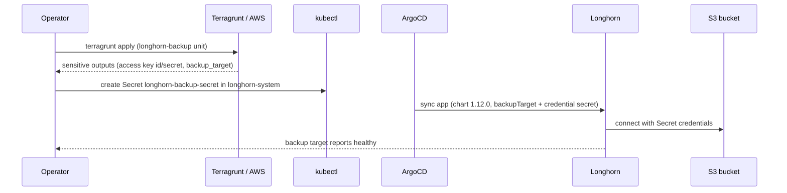

# feat: Longhorn on k3s with S3 backup

## Summary

Update the existing ArgoCD Longhorn application to chart `1.12.0` and wire it to an S3 backup target. A new Terragrunt unit and module provision an AWS S3 bucket plus a least-privilege IAM user and access key in the same account/region as the Terraform state backend; Longhorn reads those credentials from a Kubernetes Secret applied out-of-band from Terraform's sensitive outputs.

---

## Problem Frame

Longhorn provides distributed block storage for the k3s cluster, but its volumes are only as durable as the nodes holding them. The app exists today at `argocd/apps/longhorn.yaml` pinned at `v1.8.1` with no backup target. This plan moves it to the current chart and gives volumes an off-cluster backup target in the same AWS account that already holds the Terraform state (`see origin: docs/brainstorms/2026-06-14-longhorn-s3-backup-requirements.md`).

---

## Requirements

**Longhorn deployment**

- R1. The Longhorn ArgoCD Application is updated in place to chart `1.12.0`, retaining its single-source structure and the `preUpgradeChecker.jobEnabled: false` value. (origin R1)
- R2. Longhorn continues to deploy into `longhorn-system` with `CreateNamespace=true`. (origin R2)

**S3 backup infrastructure (Terraform)**

- R3. A new Terragrunt unit and module provision an AWS S3 bucket for Longhorn backups in the same account and region as the existing state backend (`us-east-2`), reusing the shared S3 backend in `terraform/root.hcl`. (origin R3)
- R4. The bucket blocks all public access and has server-side encryption enabled; it has no versioning or lifecycle rules — backup retention is owned by Longhorn. (origin R4, revised this session)
- R5. A dedicated IAM user is created with a least-privilege policy scoped to only that bucket, plus a programmatic access key. (origin R5)
- R6. The access key id and secret are exposed as sensitive Terraform outputs; no credentials are committed to git. (origin R6)

**Terragrunt provider structure**

- R7. Provider generation lives per-unit; `terraform/root.hcl` provides only the shared S3 remote state, so the AWS unit is not injected with the Proxmox provider. (this session)

**Backup wiring and credentials**

- R8. Longhorn's `defaultSettings.backupTarget` is set to `s3://<bucket>@<region>/` and `defaultSettings.backupTargetCredentialSecret` references a Secret in `longhorn-system`. (origin R7)
- R9. The credential Secret is created out-of-band from the Terraform outputs and is never managed by ArgoCD or stored in git. (origin R8)
- R10. The Terraform README documents the sequence: apply → read sensitive outputs → create the `longhorn-system` Secret → ArgoCD syncs the configured backup target. (origin R9)

---

## Key Technical Decisions

- **Provider generation moves per-unit; `root.hcl` keeps only `remote_state`.** The root's `generate "provider"` block currently injects a `proxmox` provider into every unit. A pure-AWS unit would then fail `init` (Terraform resolves an implicit `hashicorp/proxmox` that does not exist). Moving provider generation into each unit is the standard Terragrunt structure and avoids per-unit override hacks. This edits `terraform/root.hcl` and adds a `generate "provider"` block to `terraform/proxmox-vms/terragrunt.hcl` — a functional no-op for the existing VMs.
- **Least-privilege IAM with seven S3 actions scoped to the one bucket.** `s3:GetObject`, `s3:PutObject`, `s3:DeleteObject`, `s3:ListBucket`, `s3:GetBucketLocation`, `s3:AbortMultipartUpload`, `s3:ListMultipartUploadParts` on the bucket ARN and `<bucket>/*` only. `GetBucketLocation` and the multipart actions are required by Longhorn (resolves the origin's deferred IAM question).
- **Credentials via a manually-applied Secret; no secrets operator.** Terraform emits the access key as sensitive outputs; the Secret is created with `kubectl` out-of-band. Secret keys are `AWS_ACCESS_KEY_ID` and `AWS_SECRET_ACCESS_KEY` — `AWS_ENDPOINTS`/`VIRTUAL_HOSTED_STYLE` are S3-compatible-only and not set for native AWS S3. The `sensitive` outputs hide the key from CLI logs but not from Terraform state; with no secrets operator there is no automatic rotation (see Risks).
- **Clean install at `1.12.0` via in-place app update.** The cluster is newly provisioned, so the `1.8 → 1.12` minor-skip restriction (unsupported with live volumes) does not apply. Keep the `defaultSettings.backupTarget` bootstrap path as specified in the brainstorm.
- **Bucket hardening = block public access + SSE only.** No S3 versioning or lifecycle, since Longhorn manages backup retention.

---

## High-Level Technical Design

Backup bootstrap is a one-time, cross-system data flow from Terraform outputs through a manual Secret into Longhorn:



The Secret is the only manual hop; everything else reconciles declaratively (Terraform for AWS, ArgoCD for Longhorn).

---

## Output Structure

New files (created) and the existing files this plan modifies:

```text
terraform/
  root.hcl                          # modify — drop generate "provider", keep remote_state
  longhorn-backup/
    terragrunt.hcl                  # create — include root, source module, generate AWS provider, inputs
  modules/
    longhorn-backup/
      versions.tf                   # create — required aws provider
      variables.tf                  # create — bucket_name, region, tags
      s3.tf                         # create — bucket, public-access block, SSE
      iam.tf                        # create — user, least-priv policy, access key
      outputs.tf                    # create — bucket, region, backup_target, sensitive creds
  proxmox-vms/
    terragrunt.hcl                  # modify — add generate "provider" (proxmox), moved from root
  README.md                         # modify — document the Secret bootstrap step
argocd/
  apps/
    longhorn.yaml                   # modify — chart 1.12.0 + backup defaultSettings
```

The per-unit `**Files:**` sections remain authoritative for what each unit touches.

---

## Implementation Units

### U1. Move Terragrunt provider generation per-unit

- **Goal:** `root.hcl` provides only the shared S3 backend; the `proxmox-vms` unit generates its own Proxmox provider, so a pure-AWS unit can supply its own provider without inheriting Proxmox.
- **Requirements:** R7
- **Dependencies:** none
- **Files:**
  - `terraform/root.hcl` (modify) — remove the `generate "provider"` block; keep `remote_state`.
  - `terraform/proxmox-vms/terragrunt.hcl` (modify) — add a `generate "provider"` block carrying the existing Proxmox provider (endpoint `https://192.168.1.10:8006/`, `insecure = true`).
- **Approach:** Lift the current Proxmox provider block verbatim from `root.hcl` into the `proxmox-vms` unit. No resource or input changes.
- **Patterns to follow:** the existing `generate "provider"` block syntax in `terraform/root.hcl`.
- **Execution note:** Confirm `terragrunt plan` in `terraform/proxmox-vms` is a no-op after the move before proceeding.
- **Test scenarios:**
  - `terragrunt validate` in `terraform/proxmox-vms` passes.
  - `terragrunt plan` in `terraform/proxmox-vms` reports no resource changes (provider relocation must not alter the VMs).
  - `terragrunt init` in `terraform/proxmox-vms` still resolves `bpg/proxmox`.
- **Verification:** the `proxmox-vms` plan is a clean no-op and `provider.tf` is still generated in that unit's working directory.

### U2. Provision the S3 backup bucket and IAM

- **Goal:** A new module + unit create the backup bucket, a scoped IAM user/policy, and an access key, surfaced as outputs (including the ready-to-use backup-target URL).
- **Requirements:** R3, R4, R5, R6
- **Dependencies:** U1
- **Files:**
  - `terraform/modules/longhorn-backup/versions.tf` (create) — `required_version` and the `hashicorp/aws` provider.
  - `terraform/modules/longhorn-backup/variables.tf` (create) — `bucket_name`, `region`, optional `tags`.
  - `terraform/modules/longhorn-backup/s3.tf` (create) — `aws_s3_bucket`, `aws_s3_bucket_public_access_block` (all four flags true), `aws_s3_bucket_server_side_encryption_configuration` (AES256).
  - `terraform/modules/longhorn-backup/iam.tf` (create) — `aws_iam_user`, a least-privilege policy with the seven S3 actions on the bucket + `<bucket>/*` ARNs, and `aws_iam_access_key`.
  - `terraform/modules/longhorn-backup/outputs.tf` (create) — `bucket`, `region`, `backup_target` (`s3://<bucket>@<region>/`), `access_key_id` (sensitive), `secret_access_key` (sensitive).
  - `terraform/longhorn-backup/terragrunt.hcl` (create) — `include "root"`, `source = "../modules/longhorn-backup"`, a `generate "provider"` AWS block (`region = "us-east-2"`; profile comes from `AWS_PROFILE`), and `inputs` (proposed `bucket_name = "gbsoft-homelab-longhorn-backup"`).
- **Approach:** Mirror the `proxmox-vms` module/unit layout. Proposed names follow the `gbsoft-homelab-*` convention: bucket `gbsoft-homelab-longhorn-backup`, IAM user `gbsoft-homelab-longhorn-backup`, policy `gbsoft-homelab-longhorn-backup-pol`. The AWS provider picks up the `homelab` profile from `AWS_PROFILE` (same as the state backend).
- **Patterns to follow:** `terraform/modules/proxmox-vms/{versions.tf,variables.tf,outputs.tf}` for module shape; `terraform/proxmox-vms/terragrunt.hcl` for the include/source/inputs shape.
- **Test scenarios:**
  - `terragrunt validate` in `terraform/longhorn-backup` passes.
  - `terragrunt init` resolves only the AWS provider — no Proxmox provider is requested (confirms R7/U1 for this unit).
  - `terragrunt plan` creates exactly one bucket, a public-access block with all four flags `true`, an SSE configuration, one IAM user, one policy, and one access key.
  - The planned IAM policy's actions equal the seven required actions and its `Resource` is the bucket ARN plus `<bucket>/*` only (no wildcard account access).
  - `access_key_id` and `secret_access_key` outputs are marked `sensitive` and are not rendered in plan/apply logs.
- **Verification:** plan applies cleanly; `terragrunt output` returns the bucket, `backup_target`, and the two sensitive credential values.

### U3. Update the Longhorn ArgoCD app (chart 1.12.0 + backup wiring)

- **Goal:** Bump the chart and add the backup target and credential-secret reference to the app's Helm values.
- **Requirements:** R1, R2, R8
- **Dependencies:** U2
- **Files:**
  - `argocd/apps/longhorn.yaml` (modify) — `targetRevision: v1.8.1` → `1.12.0`; extend `helm.values` with `defaultSettings`, keeping `preUpgradeChecker.jobEnabled: false`.
- **Approach:** Directional values shape (retaining the existing single source and `destination`):

  ```yaml
  helm:
    values: |
      preUpgradeChecker:
        jobEnabled: false
      defaultSettings:
        backupTarget: s3://gbsoft-homelab-longhorn-backup@us-east-2/
        backupTargetCredentialSecret: longhorn-backup-secret
  ```
- **Patterns to follow:** the existing `helm.values` string in `argocd/apps/longhorn.yaml`; `argocd/apps/cert-manager.yaml` shows the `valuesObject` alternative (not switching to it).
- **Test scenarios:**
  - `kubectl apply --dry-run=client -f argocd/apps/longhorn.yaml` parses without error.
  - `targetRevision` equals `1.12.0`.
  - `helm.values` contains `backupTarget: s3://gbsoft-homelab-longhorn-backup@us-east-2/`, `backupTargetCredentialSecret: longhorn-backup-secret`, and still contains `preUpgradeChecker.jobEnabled: false`.
  - `Covers AE1.` With the Secret present, ArgoCD sync produces a Longhorn backup target that reports healthy.
- **Verification:** ArgoCD app diff/sync applies cleanly and Longhorn's settings reflect the configured backup target.

### U4. Document the credential-Secret bootstrap

- **Goal:** The Terraform README explains how to turn the unit's sensitive outputs into the `longhorn-system` Secret Longhorn reads.
- **Requirements:** R9, R10
- **Dependencies:** U2, U3
- **Files:**
  - `terraform/README.md` (modify) — add a "Longhorn S3 backup" section: `terragrunt apply` the new unit, read the sensitive outputs, create `longhorn-backup-secret` in `longhorn-system` with keys `AWS_ACCESS_KEY_ID` / `AWS_SECRET_ACCESS_KEY`, then let ArgoCD sync. State that the Secret is never committed.
- **Approach:** Follow the existing README structure (Prerequisites / Environment / Apply / Outputs). The documented `kubectl create secret generic` command's key names must match Longhorn's expected `AWS_ACCESS_KEY_ID` / `AWS_SECRET_ACCESS_KEY` and the secret name must match `backupTargetCredentialSecret` from U3.
- **Test scenarios:** Test expectation: none -- documentation only; verified by review that the documented commands match the U2 outputs, the U3 secret name, and Longhorn's expected secret keys.
- **Verification:** a reader can follow the steps end-to-end without referring to external Longhorn docs for key names or URL format.

---

## Acceptance Examples

- AE1. Backup target connects
  - **Covers R8, R9.**
  - **Given** the credential Secret exists with valid keys and `backupTarget` is set,
  - **When** Longhorn evaluates the backup target,
  - **Then** it reports the target as connected/healthy with no authentication error.
- AE2. A volume backup lands in S3
  - **Covers R3, R5.**
  - **Given** a healthy backup target,
  - **When** a volume backup is triggered and completes,
  - **Then** a backup object appears under the bucket and the volume shows a backup in Longhorn.

---

## Scope Boundaries

### Deferred to Follow-Up Work

- Recurring backup schedules (Longhorn RecurringJobs) and snapshot policies — this plan wires the backup target only.
- Restore / disaster-recovery runbook.
- A secrets operator (sealed-secrets / external-secrets) to automate the credential Secret.
- S3 versioning and lifecycle rules — retention is handled on the Longhorn side.

---

## Risks & Dependencies

- The `homelab` AWS profile must have permission to create the S3 bucket, IAM user, policy, and access key.
- Longhorn `1.12.0` may steer backup configuration toward the `BackupTarget` custom resource; the `defaultSettings.backupTarget` / `backupTargetCredentialSecret` bootstrap path is still supported, but verify it applies on this chart at implementation time and fall back to a `BackupTarget` CR if not (see Open Questions).
- The Secret must exist in `longhorn-system` before backups work; if it is absent or holds wrong credentials, Longhorn reports a backup-target error rather than silently failing.
- The IAM secret access key is persisted in Terraform state in the `gbsoft-homelab-tfstate` bucket — `sensitive` outputs only suppress CLI/log rendering. Mitigation: the state backend is private and `encrypt = true` (`terraform/root.hcl`); rotate the key periodically since nothing rotates it automatically. Acceptable posture for this homelab; revisit if a secrets operator is later adopted.
- Moving provider generation (U1) must be a no-op for `proxmox-vms`; verified by the U1 plan check before the AWS unit is applied.

---

## Open Questions (Deferred to Implementation)

- Final resource names if deviating from the proposed `gbsoft-homelab-longhorn-backup` (bucket/user), `gbsoft-homelab-longhorn-backup-pol` (policy), and `longhorn-backup-secret` (Secret).
- Confirm chart `1.12.0` honors `defaultSettings.backupTarget` / `backupTargetCredentialSecret` as the bootstrap path versus requiring a `BackupTarget` CR.
- Server-side encryption mode: default to SSE-S3 (AES256) unless SSE-KMS is wanted.

---

## Sources & Research

- `helm search repo longhorn/longhorn --versions` → latest chart `1.12.0` (app `v1.12.0`); existing app pins `v1.8.1`.
- Longhorn "Setting a Backup Target" (longhorn.io docs) and SUSE Storage "Configure a Backup Target" — confirm secret keys (`AWS_ACCESS_KEY_ID` / `AWS_SECRET_ACCESS_KEY`), the `s3://<bucket>@<region>/` URL format, and the required IAM action set including `GetBucketLocation` and the multipart actions.
- `argocd/apps/longhorn.yaml`, `argocd/apps/cert-manager.yaml`, `argocd/apps/metallb.yaml` — ArgoCD Application and Helm-values patterns.
- `terraform/root.hcl` — shared S3 state backend (`gbsoft-homelab-tfstate`, `us-east-2`) and the provider `generate` block being relocated.
- `terraform/proxmox-vms/`, `terraform/modules/proxmox-vms/`, `.envrc.example` — unit/module layout and the `homelab` AWS profile convention to mirror.
- Origin requirements: `docs/brainstorms/2026-06-14-longhorn-s3-backup-requirements.md`.
